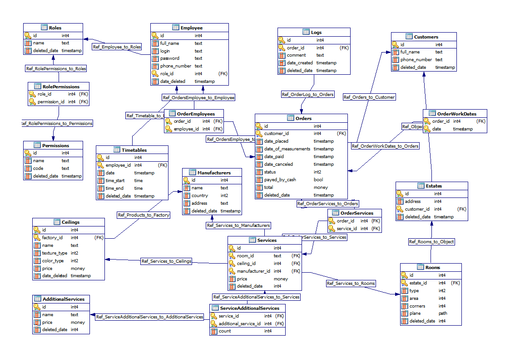

# StretchCeilings Database
<hr>

Данный репозиторий содержит реляционную базу данных, схему реляционной базы данных, запросы на выборку данных.
<br>
Цель данной работы - получение навыков построения реляционных баз данных и знакомство с SQL синтаксисом

Схема базы данных создана при помощи **[Microolap Batabase Designer for Postgre SQL](https://www.microolap.com/products/database/postgresql-designer/download/)**
<br>
Сама база данных создана при помощи **[SQLiteStudio](https://sqlitestudio.pl/)**
<br>
Приложения, которое использует данную БД - **[StretchCeilings](https://github.com/romankravchuk/StretchCeilings)**

### Схема базы данных
<hr>



### Запросы к базе данных
<hr>

#### 1. Самая популярная дополнительная услуга в сентябре.

```sql
SELECT AdditionalServices.*, MAX(T.Count) Count
FROM AdditionalServices
INNER JOIN (
	SELECT ServiceAdditionalServices.AdditionalServiceId , SUM(ServiceAdditionalServices.Count) Count
	FROM ServiceAdditionalServices
	INNER JOIN OrderServices ON OrderServices.ServiceId = ServiceAdditionalServices.ServiceId
	INNER JOIN Services ON ServiceAdditionalServices.ServiceId = Services.Id
	INNER JOIN Orders ON Orders.Id = OrderServices.OrderId
	WHERE Orders.DatePlaced BETWEEN "2022-09-01 00:00:00" AND "2022-10-01 00:00:00"
		AND Orders.DeletedDate IS NULL AND Services.DeletedDate IS NULL
	GROUP BY ServiceAdditionalServices.AdditionalServiceId
) T ON T.AdditionalServiceId = AdditionalServices.Id
```

#### 2. Мастер, у которого больше всего заказов в августе.

```sql
SELECT Employees.*, MAX(O.Count) Count
FROM Employees
INNER JOIN (
	SELECT OrderEmployees.EmployeeId, COUNT(OrderEmployees.OrderId) Count
	FROM OrderEmployees
	INNER JOIN Employees ON Employees.Id = OrderEmployees.EmployeeId
	INNER JOIN Orders ON Orders.Id = OrderEmployees.OrderId
	WHERE Employees.RoleId == 3 AND Orders.DatePlaced BETWEEN "2022-08-01 00:00:00" AND "2022-09-01 00:00:00" 
		AND Orders.DeletedDate IS NULL AND Employees.DeletedDate IS NULL
	GROUP BY OrderEmployees.EmployeeId
) O ON O.EmployeeId = Employees.Id
```

#### 3. Кол-во доп. услуг за все время.

```sql
SELECT AdditionalServices.*, T.Count FROM AdditionalServices 
INNER JOIN (
	SELECT ServiceAdditionalServices.AdditionalServiceId , SUM(ServiceAdditionalServices.Count) Count
	FROM ServiceAdditionalServices
	INNER JOIN OrderServices ON OrderServices.ServiceId = ServiceAdditionalServices.ServiceId
	INNER JOIN Services ON ServiceAdditionalServices.ServiceId = Services.Id
	INNER JOIN Orders ON Orders.Id = OrderServices.OrderId AND Orders.DeletedDate IS NULL AND Services.DeletedDate IS NULL
	GROUP BY ServiceAdditionalServices.AdditionalServiceId
) T ON T.AdditionalServiceId = AdditionalServices.Id
WHERE AdditionalServices.Id = T.AdditionalServiceId
```

#### 4. Неиспользуемые доп. услуги в сентрябре.

```sql
SELECT AdditionalServices.* FROM AdditionalServices
WHERE NOT AdditionalServices.Id IN (
	SELECT ServiceAdditionalServices.AdditionalServiceId
	FROM ServiceAdditionalServices
	INNER JOIN OrderServices ON OrderServices.ServiceId = ServiceAdditionalServices.ServiceId
	INNER JOIN Services ON ServiceAdditionalServices.ServiceId = Services.Id
	INNER JOIN Orders ON Orders.Id = OrderServices.OrderId
	WHERE Orders.DatePlaced BETWEEN "2022-09-01 00:00:00" AND "2022-10-01 00:00:00"
		AND Orders.DeletedDate IS NULL AND Services.DeletedDate IS NULL
	GROUP BY ServiceAdditionalServices.AdditionalServiceId
)
```

#### 5. Количество обслуженных заказов мастерами.

```sql
SELECT Employees.*, Count(OrderEmployees.OrderId) Count FROM Employees
INNER JOIN OrderEmployees ON OrderEmployees.EmployeeId = Employees.Id
INNER JOIN (
	SELECT Orders.Id FROM Orders
	WHERE Orders.DeletedDate IS NULL
) O ON O.Id = OrderEmployees.OrderId
WHERE Employees.DeletedDate IS NULL
GROUP BY Employees.Id
```

#### 6. Заказы, которые не выполнял указанный мастер.

```sql
SELECT Orders.* FROM Orders
WHERE Orders.Id NOT IN (
	SELECT Orders.Id FROM Orders
	INNER JOIN OrderEmployees ON OrderEmployees.OrderId = Orders.Id
	WHERE OrderEmployees.EmployeeId = @id
)
GROUP BY Orders.Id
```

> Комментарий: **`@id`** - переменная, значение которой является **идентификатор** мастера.

#### 7. Заказ, где есть доп. услуга с указанным наименованием.

```sql
SELECT Orders.* FROM Orders
INNER JOIN OrderServices ON OrderServices.OrderId = Orders.Id
INNER JOIN Services ON Services.Id = OrderServices.ServiceId
INNER JOIN ServiceAdditionalServices ON ServiceAdditionalServices.ServiceId = Services.Id
INNER JOIN AdditionalServices ON AdditionalServices.Id = ServiceAdditionalServices.AdditionalServiceId 
    AND AdditionalServices.Name = @name
GROUP BY Orders.Id
```

> Комментарий: **`@name`** - переменная, значение которой является **наименовением** доп. услуги.

#### 8. Заказы, где номера телефонов клиентов начинаются на +7(950).

```sql
SELECT Orders.* FROM Orders
INNER JOIN Customers ON Customers.Id = Orders.CustomerId AND Customers.PhoneNumber LIKE "+7(950)%"
WHERE Customers.DeletedDate IS NULL
GROUP BY Orders.Id
```

#### 9. Заказы, где нет доп. услуг с указанным диапозоном id.

```sql
SELECT Orders.* FROM Orders
INNER JOIN OrderServices ON OrderServices.OrderId = Orders.Id
INNER JOIN Services ON Services.Id = OrderServices.ServiceId
INNER JOIN ServiceAdditionalServices ON ServiceAdditionalServices.ServiceId = Services.Id
INNER JOIN AdditionalServices ON AdditionalServices.Id = ServiceAdditionalServices.AdditionalServiceId
WHERE Orders.DeletedDate IS NULL
GROUP BY Orders.Id
HAVING AdditionalServices.Id NOT BETWEEN @from AND @until
```

> Комментарий: **`@from`** и **`@until`** - переменные, значения которых являются **началом** и **концом** диапозона соотвественно.