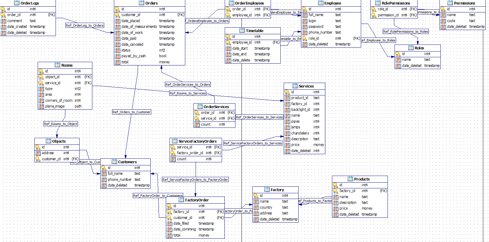

# SQLite Datebase and queries

Данный репозиторий содержит реляционную базу данных; схему реляционной базы данных; запросы на выборку данных; картинки таблиц, схемы.

Цель данной работы - получение навыков построения реляционных баз данных и знакомство с SQL синтаксисом

<hr>

## База данных, к которой строились запросы. 

* Файл базы данных [тут](database/db_sqlite.db)
* Файл схемы базы данных [тут](database/db_scheme.pdd)

Схема базы данных создана при помощи программы **[Microolap Batabase Designer for Postgre SQL](https://www.microolap.com/products/database/postgresql-designer/download/)**

Сама база данных создана при помощи **[SQLiteStudio](https://sqlitestudio.pl/)**

<hr>

## Схема базы данных


<hr>

## Запросы к базе данных

### 1. Самая популярная услуга в сентябре:
```sql
SELECT Services.id, Services.name, SUM(OrderServices.count) count FROM Services
INNER JOIN OrderServices ON Services.id = OrderServices.service_id
WHERE Services.date_deleted IS NULL AND  Services.id IN (
    SELECT OrderServices.service_id FROM OrderServices
    INNER JOIN Orders ON Orders.id = OrderServices.order_id
    WHERE Orders.date_canceled IS NULL AND Orders.date_placed BETWEEN "2020-09-01" AND "2020-09-31"
)
GROUP BY Services.id, Services.name
ORDER BY count DESC
LIMIT 1
```

<br>

### 2. Мастер, у которого больше всего заказов в августе.
```sql
SELECT Employees.id, Employees.full_name, Count(OrderEmployees.order_id) Count FROM Employees
INNER JOIN OrderEmployees ON Employees.id = OrderEmployees.employee_id
WHERE Employees.date_deleted IS NULL AND  OrderEmployees.order_id IN (
    SELECT Orders.id FROM Orders
    WHERE Orders.date_canceled IS NULL AND Orders.date_placed BETWEEN "2020-08-01" AND "2020-09-01"
)
GROUP BY Employees.id, Employees.full_name
ORDER BY Count DESC
LIMIT 1
```

<br>

### 3. Кол-во услуг за все время.
```sql
SELECT Services.id, Services.name, Count(OrderServices.order_id) Count FROM Services
INNER JOIN OrderServices ON Services.id = OrderServices.service_id
WHERE Services.date_deleted IS NULL
GROUP BY Services.id, Services.name

```

<br>

### 4. Неиспользуемые в сентябре услуги.
```sql
SELECT Services.id, Services.name FROM Services
WHERE Services.date_deleted IS NULL AND Services.id NOT IN (
    SELECT OrderServices.service_id FROM OrderServices
    INNER JOIN Orders ON Orders.id = OrderServices.order_id
    WHERE Orders.date_canceled IS NULL AND Orders.date_placed BETWEEN "2020-09-01" AND "2020-09-31"
)
```

<br>

### 5. Количество обслуженных заказов мастерами.
```sql
SELECT Employees.id, Employees.full_name, Count(OrderEmployees.order_id) Count FROM Employees
INNER JOIN OrderEmployees ON Employees.id = OrderEmployees.employee_id
WHERE Employees.date_deleted IS NULL AND  OrderEmployees.order_id IN (
    SELECT Orders.id FROM Orders
    WHERE Orders.date_canceled IS NULL
)
GROUP BY Employees.id, Employees.full_name
```

<br>

### 6. Заказы, которые не выполнял указанный мастер.
```sql
SELECT Orders.* FROM Orders
INNER JOIN OrderEmployees ON OrderEmployees.order_id = Orders.id
WHERE Orders.date_canceled IS NULL AND OrderEmployees.order_id NOT IN (
    SELECT OrderEmployees.order_id FROM OrderEmployees
    INNER JOIN Orders ON Orders.id = OrderEmployees.order_id
    WHERE employee_id = @id AND employee_id IS NOT NULL
)
GROUP BY Orders.id
```

Комментарий: **`@id`** - переменная, значение которой является **идентификатор** мастера.

<br>

### 7. Заказ, где есть услуга с указанным наименованием.
```sql
SELECT Orders.id, Orders.date_placed, Orders.total FROM Orders
INNER JOIN OrderServices ON Orders.id = OrderServices.order_id
INNER JOIN Services ON Services.id = OrderServices.service_id AND Services.name = @service_name
WHERE Orders.date_canceled IS NULL
GROUP BY Orders.id, Orders.date_placed, Orders.total
```

Комментарий: **`@service_name`** - переменная, значение которой является **наименовением** услуги.

<br>

### 8. Заказы, где номера телефонов клиентов начинаются на 7999.
```sql
SELECT Orders.id, Customers.full_name, Customers.phone_number FROM Orders
INNER JOIN Customers ON Customers.id = Orders.customer_id AND Customers.phone_number LIKE "7999%"
WHERE Customers.date_deleted IS NULL
GROUP BY Orders.id, Customers.full_name, Customers.phone_number
```

<br>

### 9. Заказы, где нет услуг с указанным диапозоном id.
```sql
SELECT Orders.id, Orders.date_placed, Orders.total FROM Orders
INNER JOIN OrderServices ON Orders.id = OrderServices.order_id
WHERE Orders.date_canceled IS NULL
GROUP BY Orders.id, Orders.date_placed, Orders.total
HAVING OrderServices.service_id NOT BETWEEN @id_from AND @id_to
```

Комментарий: **`@id_from`** и **`@id_to`** - переменные, значения которых являются **началом** и **концом** диапозона соотвественно.

<br>